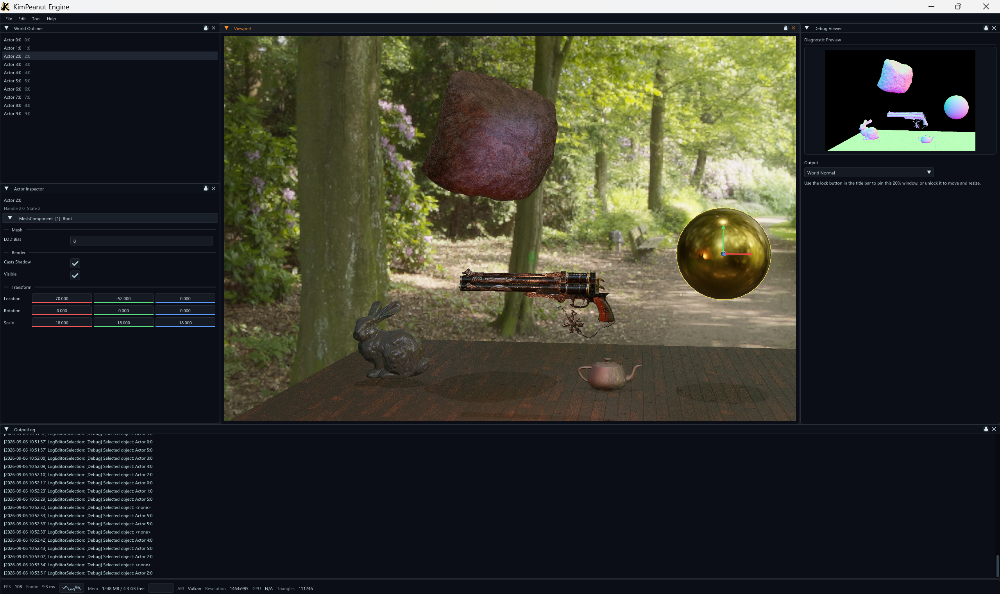

# KimPeanut Engine



KimPeanut Engine (KP Engine) is a C++ game-engine R&D project centered on rendering and low-level engine infrastructure. The project focuses on clear resource ownership, GPU lifetime management, testable module boundaries, and a portable rendering contract that can be implemented by OpenGL and Vulkan.

> Chinese documentation: [README.md](README.md)

## Project goal

- Build clear, testable, and extensible C++ game-engine infrastructure.
- Manage assets and GPU resources through an explicit Asset → Resource → Render → RHI flow.
- Use Vulkan as the primary modern graphics path while retaining OpenGL for portability and backend-parity experiments.
- Separate render policy, resource processing, GPU execution, and editor UI.
- Evolve through validated incremental refactors instead of hidden global state or backend-owned application logic.

## What is it?

KimPeanut Engine is currently an active R&D project focused on renderer, resource-system, and editor foundations. It is not a stable commercial engine release, and it is not only a single-triangle graphics sample. The current work turns a runnable renderer into a maintainable engine with explicit ownership and dependency boundaries.

## Technical overview

| Area | Current choice |
|---|---|
| Language standard | C++17 |
| Build system | CMake |
| Primary toolchain | MSVC / Visual Studio 2022; Windows-first validation |
| Graphics backends | Vulkan and OpenGL |
| Window system | GLFW |
| Editor UI | Dear ImGui |
| Model import | Assimp |
| Image/audio | stb_image and miniaudio |
| Scripting | Lua / sol2 |
| Testing | GoogleTest and CTest |
| Shader processing | GLSL → SPIR-V or OpenGL source, with content-addressed caching |

## Current features

### Engine infrastructure

- Layered Runtime and Editor architecture.
- AssetManager asset identity, caching, dependency tracking, and lifetime management.
- ResourcePipeline CPU-side processing and shader caching.
- Asynchronous asset-request queue with render-side budgeted consumption.
- Custom math, handles, event dispatch, logging, and configuration modules.
- Lua VM hosting layer with headless unit tests.

### Rendering and RHI

- Vulkan and OpenGL backend implementations.
- API-neutral handles for pipelines, meshes, textures, samplers, render targets, and descriptor sets.
- Common command recording to keep Render independent from native graphics commands.
- FrameContext ownership for transient uniform data and frame-local bindings.
- Render-pass scheduling, RenderWorld, MeshProxy, and material systems.
- PBR, textured materials, color/depth targets, basic shadows, and deferred-rendering direction.
- Vulkan upload, memory, swapchain, descriptor, and editor-presentation modules.

### Editor and validation

- ImGui-based editor component tree.
- OpenGL/Vulkan editor presentation interfaces.
- GraphicsSmoke coverage for backend startup, rendering, resize, and resource shutdown.
- Unit tests for Render, Graphics, Asset, Audio, Script, and Profile modules.
- Architecture documentation, status tracking, and open-source engine reference studies.

## Optional modules

### TTS (Text-to-Speech)

TTS is an optional module outside the core rendering path. It connects to an external speech-synthesis service through a provider interface. The current implementation provides an HTTP GPT-SoVITS provider and feeds synthesized audio into the engine's AudioSystem.

- Synchronous and asynchronous synthesis APIs.
- Buffered and streaming playback paths.
- Streaming responses are decoded incrementally through `AudioStreamDecoder`, a FIFO, and `StreamAudioPlayer`.
- `TTSResult` returns an audio-player handle so callers control playback through AudioSystem.
- The provider interface leaves room for cloud, local, or offline TTS backends.

TTS requires a separately running GPT-SoVITS service; the example defaults to `127.0.0.1:9880/tts`. The voice-reference path is interpreted by the TTS server and is not uploaded automatically by the client. See the [TTS module documentation](docs/tts/tts_module.md) for the API, data flow, and known limitations.

## Code size

Repository snapshot as of **2026-08-26**:

- Approximately **23,348 lines** of C/C++ code.
- **287** C/C++ source files.
- Counted extensions: `.cpp`, `.h`, `.hpp`, `.c`, `.cc`, and `.inl` under `engine/`.
- Excludes `third_party/`, `build/`, `build-opengl-only/`, generated files, and binary assets.
- Includes runtime, editor, examples, and tests; this is not a core-library-only LOC count.

LOC is a development snapshot, not a quality metric. Dependency direction, ownership, and validation matter more than minimizing the line count.

## Directory layout

```text
KimPeanutEngine/
├── engine/
│   ├── runtime/
│   │   ├── core/          # math, base types, logging, config, async, resources
│   │   ├── asset/         # asset loading, caching, dependencies, lifetime
│   │   ├── graphics/      # RHI contracts and OpenGL/Vulkan backends
│   │   ├── render/        # RenderSystem, materials, RenderWorld, passes, frames
│   │   ├── audio/         # audio systems and players
│   │   ├── input/         # input abstraction
│   │   ├── script/        # Lua host and scripting boundary
│   │   ├── window/        # window system
│   │   └── bootstrap/     # startup configuration and preload requests
│   ├── editor/            # editor shell, UI components, tools, presentation
│   ├── example/           # Asset, Graphics, Audio, TTS examples
│   ├── module/            # optional engine modules
│   └── test/unit/         # GoogleTest unit and contract tests
├── config/                # startup and runtime configuration
├── docs/                  # architecture, status, decisions, reference studies
├── third_party/           # vendored dependencies; not engine core
├── cmake/                 # CMake helper logic
└── CMakeLists.txt
```

## Architecture overview

```text
┌──────────────────────────────────────────────┐
│ Editor                                       │
│ ImGui tools · viewport · logs · settings     │
└──────────────────────┬───────────────────────┘
                       │ editor/runtime seam
┌──────────────────────▼───────────────────────┐
│ Runtime / Engine                             │
│ lifecycle · input · window · gameplay basis  │
└───────────────┬───────────────────┬──────────┘
                │                   │
┌───────────────▼────────┐  ┌──────▼───────────┐
│ Asset / Resource        │  │ Render            │
│ load · process · cache  │  │ scene · material  │
│ CPU-side artifacts      │  │ pass · frame data │
└───────────────┬────────┘  └──────┬───────────┘
                │                   │
                └──────────┬────────┘
                           ▼
                 ┌────────────────────┐
                 │ Graphics RHI        │
                 │ handles · commands  │
                 │ GPU lifetime        │
                 └─────────┬──────────┘
                           ▼
                 ┌────────────────────┐
                 │ OpenGL / Vulkan     │
                 │ API implementation  │
                 └────────────────────┘
```

Core data flow:

```text
Asset file
   → AssetManager
   → ResourcePipeline
   → RenderResource / PipelineDesc
   → RHI resource handle
   → FrameContext + CommandRecorder
   → OpenGL or Vulkan submission
```

Ownership boundaries:

- Asset owns asset identity, loading, and CPU-side asset lifetime.
- Resource processes and caches artifacts but does not create GPU objects.
- Render owns scene policy, materials, passes, pipeline descriptions, and frame data.
- Graphics/RHI owns GPU resources, synchronization, and API execution.
- Render and common RHI contracts do not expose native Vulkan/OpenGL types.

## Build and test

Requirements:

- Visual Studio 2022 with the C++ workload.
- CMake.
- Vulkan SDK when building the Vulkan backend.

```powershell
cmake -S . -B build -G "Visual Studio 17 2022"
cmake --build build --config Debug
ctest --test-dir build -C Debug
```

For normal development, use the command wrapper to select targeted validation from the Git diff:

```powershell
.\tools\kp.ps1 validate
.\tools\kp.ps1 status
.\tools\kp.ps1 build RenderPassScheduleTest
```

Key validation targets:

- `GraphicsContractTest` — RHI contracts and pipeline descriptions.
- `RenderPassScheduleTest` — render passes, materials, RenderWorld, and handles.
- `GraphicsSmoke` — shared scene, resize, and lifetime smoke coverage for OpenGL/Vulkan.

## Documentation

- [Project status](docs/status.md)
- [Architecture overview](docs/architecture_overview.md)
- [Graphics/RHI module](docs/graphics/graphics_module.md)
- [Render module](docs/render/overview.md)
- [Asset module](docs/asset/asset_module.md)
- [TTS module](docs/tts/tts_module.md)
- [Validation matrix](docs/validation_matrix.md)
- [Agent completion evidence](docs/agent_completion_evidence.md)
- [Spec and journal workflow](.spec/README.md)
- [Engine reference index](docs/engine-reference/README.md)
- [Agent project contract](AGENTS.md)

## Design references

The project studies other engines for transferable patterns; it does not copy their source:

- [gkNextEngine](https://github.com/gameknife/gkNextEngine) — Vulkan-first rendering, modern GPU submission, and runtime validation.
- [SakuraEngine](https://github.com/SakuraEngine/SakuraEngine) — RHI, render graph, ECS, and editor structure.
- [Piccolo](https://github.com/BoomingTech/Piccolo) — Asset → Resource → Runtime layering.
- [bgfx](https://github.com/bkaradzic/bgfx) — cross-graphics-API abstraction.
- [Godot](https://github.com/godotengine/godot) — production resource and rendering systems.

## Project status

The project is evolving continuously. Current priorities are completing the Render/RHI boundary reconstruction, expanding cross-backend validation, improving materials and resource processing, and gradually adding editor and gameplay foundations.

For implementation details, known limitations, and next steps, see [`docs/status.md`](docs/status.md).
