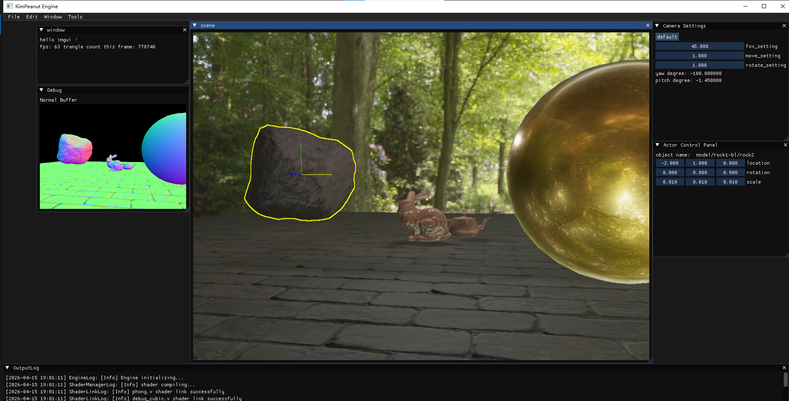

# KimPeanut Engine 


# KimPeanut Engine (KP Engine)

KimPeanut Engine 是一个基于C++ 17的 游戏引擎，目前主要实现渲染器部分

------

# 特性

- 分层引擎架构
- 资产管理和资源管理（AssetManager/ ResourcePipeline）
- 基于 RHI 的渲染抽象（OpenGL / Vulkan）
- PBR渲染
- 多线程模型（Render / Game Logic）
- 可扩展的组件化 Gameplay 框架
- 自定义数学库（Vector / Matrix）

------

# 架构设计

## 引擎分层

```text
Editor
   ↓
Engine
   ↓
Resource System
   ↓
RHI (Render Hardware Interface)
   ↓
Graphics API (Vulkan / OpenGL)
```

------

## 核心设计原则

- **数据驱动**：资源通过 Asset + Processor 转换为 GPU 数据
- **解耦**：Shader / Texture / Mesh 通过 ResourcePipeline 管理
- **跨平台**：通过 RHI 层隔离图形 API
- **缓存优先**：Shader 编译结果缓存（ShaderCache）

------

# 资源系统（Resource System）

资源系统负责：

```text
Asset → Processor → Cache → GPU Resource
```

------

## Shader Pipeline

```text
GLSL/HLSL
   ↓
ShaderProcessor
   ↓
Hash 计算（内容 + 宏 + Stage + Backend）
   ↓
ShaderCache（磁盘缓存）
   ↓
ByteCode（std::vector<uint8_t>）
   ↓
RHI 创建 ShaderModule
```

------

## ShaderCache 设计

- Key: `(hash + graphics api type)`
- Value: `ByteCode`
- 存储：磁盘（Cache/Shader/）

```text
Cache/Shader/
    Vulkan/
        xxxx.spv
```

------

# RHI（Render Hardware Interface）

目前仅支持OpenGL和Vulkan，未来考虑扩展DirectX11/12

## RHI 负责

- ShaderModule 创建
- Buffer / Texture 管理
- Pipeline 抽象
- GPU 资源生命周期

------

## Shader Binary 处理

- Cache 层：`uint8_t`
- Vulkan 使用：`uint32_t` view（SPIR-V）

------

# 渲染系统（Render System）

## 特性

- AABB
- 天空盒
- 阴影
- PBR
- Deferred Rendering

## 组成

- `render_scene`：场景渲染
- `render_camera`：摄像机
- `render_mesh`：网格实例
- `mesh_resource`：顶点/索引数据
- `render_material`：材质
- `primitive_scene_proxy`：渲染代理

------

## 渲染流程

```text
Scene → SceneProxy → RenderScene → FrameBuffer
```

------

# 多线程模型

```text
Main Thread   → Render Tick
Worker Thread → Game Logic Tick
```

------

# Gameplay 框架

- `actor`
- `actor_component`
- `scene_component`

------

# 数学库

路径：

```text
engine/runtime/core/math
```

提供：

- Vector
- Matrix
- Transform

------

# 第三方库

| 类型          | 库                      |
| ------------- | ----------------------- |
| 图形 API      | OpenGL 4.3 / Vulkan 1.3 |
| OpenGL Loader | glad / khrplatform      |
| UI            | imgui                   |
| 模型加载      | assimp                  |
| 图像加载      | stb_image               |
| Mesh优化      | meshoptimizer           |
| 枚举工具      | magic_enum              |
| 窗口系统      | GLFW                    |

------

# 系统模块

- `window_system`：窗口管理（GLFW）
- `render_system`：渲染核心系统
- `log_system`：日志系统（UI输出）
- `level_system`：场景/Actor管理

------

# Editor 架构

- `editor_global_context`：Editor 系统上下文
- 依赖 `runtime_global_context`
- 提供 UI 与输入系统

------

# 其他

- 委托：`delegate`，用于事件分发与解耦系统通信

------

# 未来计划

-  完善RHI
-  多线程资源加载
-  Editor 工具链完善
- 新模块（信号处理库【轮子】、音视频）

------

# 参考项目

- Unreal Engine
- Piccolo Engine

