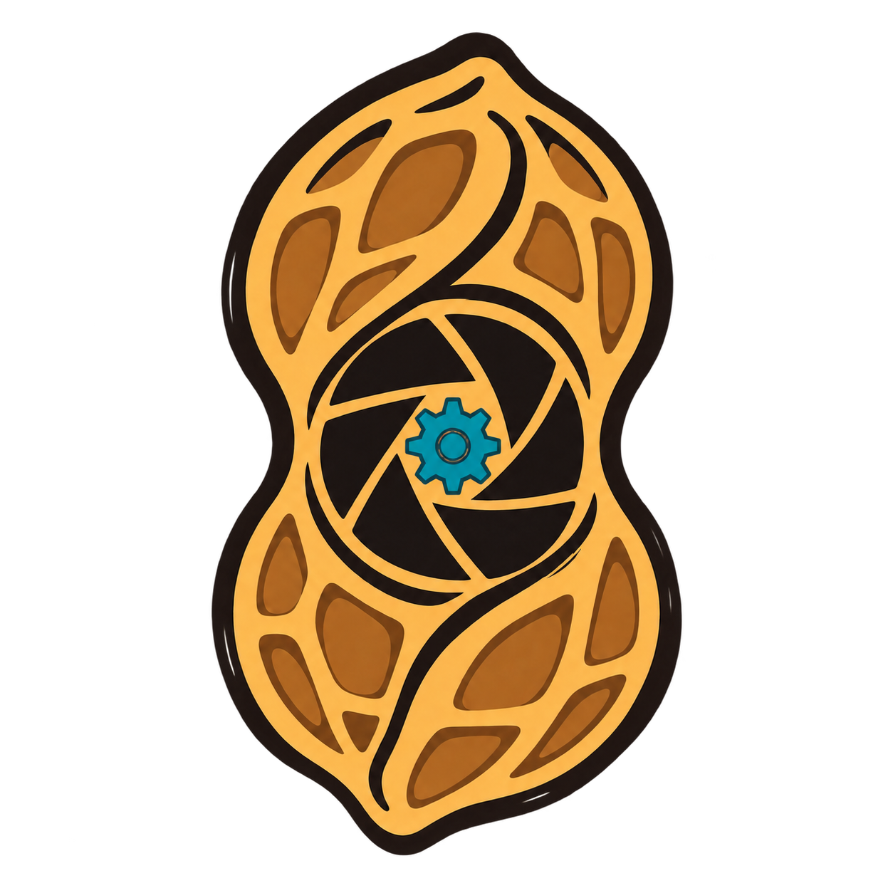

# KimPeanut Engine

<p align="center">
  
</p>


> English documentation: [README.en.md](README.en.md)

## 目录

- [项目简介](#项目简介)
- [主要特性](#主要特性)
- [技术栈](#技术栈)
- [第三方依赖](#第三方依赖)
- [构建](#构建)
- [测试](#测试)
- [文档](#文档)
- [贡献](#贡献)
- [许可证](#许可证)

## 项目简介

KimPeanut Engine（KP Engine）是一个基于 **C++17** 开发的实验性 3D 游戏引擎，目标是通过从零实现现代渲染与资源系统，探索游戏引擎底层架构与图形 API 的设计。

引擎目前支持 **Vulkan** 与 **OpenGL** 两种渲染后端，并通过自定义 **RHI（Rendering Hardware Interface）** 隔离上层渲染逻辑与具体图形 API。项目同时包含资源导入与 Cook、GPU 资源管理、渲染管线以及基础引擎框架，并持续向编辑器、工具链和游戏运行时能力扩展。

> KP Engine 更关注工程结构与底层机制的实现，而不是提供完整的商业游戏引擎功能。项目中的许多模块都用于实践和验证现代游戏引擎中的关键问题，例如资源生命周期管理、跨 API 抽象、GPU 内存管理以及可扩展的渲染架构。

完整的模块关系、数据流和所有权边界见[架构总览](docs/architecture_overview.md)。

## 主要特性

KP Engine 围绕 `Asset → Resource → Render → RHI` 构建清晰的资源与渲染数据流。

### 核心系统

- **Asset**：统一管理类型化资产、缓存、依赖关系与 CPU 生命周期，并提供同步和异步加载。
- **Resource / Import / Cook**：将 Model、Material、Texture 等源资源转换为引擎资产与渲染数据，支持依赖处理、mipmap、格式策略和 content-addressed cooking。
- **Render**：基于 RenderWorld 与 RenderProxy 组织场景渲染，负责材质、RenderTarget、Pass、SceneColor、阴影及调试捕获。
- **RHI**：通过 API-neutral handles、descriptors 与 `RenderBackend` 抽象 GPU 资源、Pipeline、Command、同步和生命周期，目前支持 Vulkan 与 OpenGL。

### 引擎与工具

- **Runtime**：窗口、输入、Gameplay、Lua 脚本及基础运行时服务。
- **Command / Agent Interface**：统一的类型化 `CommandRegistry`，供编辑器控制台、Lua、测试、本地自动化和 AI Agent 共用；支持游戏线程调度、结构化结果以及 JSON-lines 本地通信。
- **Audio **：基础音频播放系统，支持同步、异步、buffered ，streaming播放
- **Editor**：基于 Dear ImGui 的编辑器与调试工具。
- **Optional Modules**：包括 Live2D 、TTS

## 第三方依赖

引擎保留第三方库与引擎代码的边界，当前主要使用：

| 用途 | 主要依赖 |
| --- | --- |
| Asset / Resource | Assimp、stb_image、nlohmann/json、SQLite |
| Render / RHI | Vulkan、shaderc、GLFW、glad、Dear ImGui |
| Audio / TTS | miniaudio、cpp-httplib |
| Script / Reflection | Lua、sol2、EnTT、magic_enum |
| Tests | GoogleTest |

版本、许可证、CMake target 和集成方式见[第三方依赖清单](third_party/README.md)。

## 构建

环境要求：

- Visual Studio 2022 C++ 工作负载
- CMake
- 构建 Vulkan 后端时需要 Vulkan SDK

```powershell
cmake -S . -B build -G "Visual Studio 17 2022"
cmake --build build --config Debug
```

## 测试

```powershell
ctest --test-dir build -C Debug
```

日常开发也可以使用项目命令包装器执行目标验证：

```powershell
.\tools\kp.ps1 validate
.\tools\kp.ps1 build RenderPassScheduleTest
```

## 文档

- [架构总览](docs/architecture_overview.md)
- [项目状态](docs/status.md)
- [验证矩阵](docs/validation_matrix.md)
- [Graphics/RHI 模块](docs/graphics/graphics_module.md)
- [Render 模块](docs/render/overview.md)
- [Asset 模块](docs/asset/asset_module.md)
- [Command 系统](docs/command/command_system.md)
- [Gameplay 模块](docs/gameplay/gameplay_module.md)
- [TTS 模块](docs/tts/tts_module.md)
- [Live2D 模块](docs/live2d/README.md)

## 设计参考

本项目参考开源引擎的公开设计，不复制其源码：

- [gkNextEngine](https://github.com/gameknife/gkNextEngine)：Vulkan-first 渲染、GPU 提交和运行时验证。
- [SakuraEngine](https://github.com/SakuraEngine/SakuraEngine)：RHI、Render Graph、ECS 和编辑器结构。
- [Piccolo](https://github.com/BoomingTech/Piccolo)：Asset → Resource → Runtime 分层。
- [bgfx](https://github.com/bkaradzic/bgfx)：跨图形 API 抽象。
- [Godot](https://github.com/godotengine/godot)：资源和渲染系统的工程化实践。

## 贡献

欢迎通过 Issue 或 Pull Request 讨论问题、设计和实现。提交代码前请确保相关目标能够构建，并运行受影响的测试。

## 许可证

本项目使用 [MIT License](LICENSE)。第三方依赖和 Live2D Cubism SDK 受各自许可证约束。
