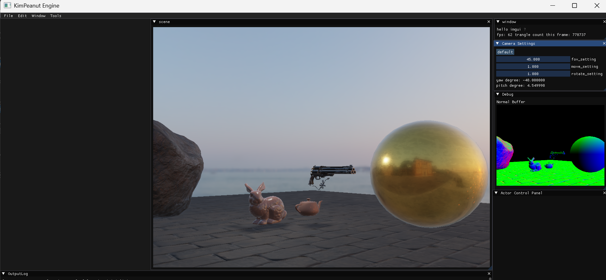

# KimPeanut Engine 

## 架构
KimPeanut Engine(KP Engine) 采用分层体系架构。

## 第三方说明

图形API：OpenGL

着色器语言：GLSL

UI框架：imgui

3D模型读取工具：assimp

图像读取工具：stb_image

## 引擎线程

主线程负责Render Tick，子线程负责Game Logic Tick

## 模块说明

游戏引擎包括编辑器(Editor)和内核(Engine)

- runtime_global_context是Engine的全局上下文，用于创建全局系统对象，包括窗口系统、渲染系统、资产系统
- editor_global_context是Editor的全局上下文，用于引用runtime的信息，同时创建editor相关系统和input系统

### 委托

delegate

## 系统

- window_system: opengl window 初始化
- render system：渲染系统(shader_pool 着色器缓存、texture_pool 纹理缓存、render_scene 渲染场景、render_camera 摄像机)
- log system：将Log输送到log ui显示
- level_system：存储actor

### 渲染

- render_camera：摄像机
- model_loader：3D模型载入工具
- render_scene：渲染场景，将场景元素渲染成帧缓存
- mesh_resource：顶点信息和索引信息
  - mesh_resource与mesh 的LOD Level成1:1关系
  - mesh_section：存储索引起点、索引数和材质
- render_shader：shader封装
- render_material：引用着色器
- render_mesh：存储mesh_resource数组，根据mesh信息初始化并生成实际vertex buffer object(vbo)和vertex array object(vao)
- primitive_scene_proxy：图元渲染代理，向渲染场景传递渲染信息，抽象类
- mesh_scene_proxy：网格渲染代理
- skybox：天空盒

## UI封装

- ui_component

## GamePlay框架

- actor
- actor_component
- scene_component

## 数学库

engine/runtime/core/math

包括vector、matrix等

## 参考

**开源游戏引擎**

Unreal Engine

Piccolo Engine

