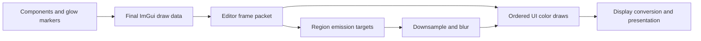

# ED5 — Selective editor UI bloom

- Status: proposed; design only, 2026-10-02
- Parent architecture: [Editor plans](../PLANS.md)
- Acceptance ledger: [Editor TODO](../TODO.md)
- Related: [ED4](ED4.md), [Graphics contract](../../graphics/graphics_module.md),
  [capture commands](../../command/built_in_commands.md#capturescreenshot)

## Outcome and design question

Allow selected text, outlines, icons, and custom visuals to produce a restrained
neon halo while retaining crisp glyphs and normal ImGui input behavior. The
first consumers are the loading wireframe and a selected accent label. Ordinary
logs, body text, controls, and scene images remain non-emissive by default.

How can Editor attach floating-point emission to ImGui's ordinary packed-color
triangles, preserve painter order and clipping, and use Vulkan/OpenGL without
changing ImGui core or its official backend sources?

Decision: **Editor owns an ImGui-to-RHI presentation adapter, explicit emission
metadata, and bounded glow regions.** Use existing common RHI primitives for
rasterization, filtering, and composition. Retain the GLFW input backend.
Keep the current native ImGui renderers as a migration/fallback path until the
new adapter passes parity and lifecycle gates on both APIs.

This is screen-space decoration. It does not illuminate scene meshes, affect
path tracing, or become a physical light source. Bloom changes neighboring
pixels; changing `TextColored` alone cannot create that effect.

### Why this approach

| Approach | Appropriate use and tradeoff |
|---|---|
| Repeated translucent text/line draws | Cheap stylistic outline/halo for a few decorations; no real filtered emission, and quality varies with size/DPI. |
| Extend native renderer wrappers with custom callbacks and offscreen passes | Smaller first prototype; requires two native pipeline/state/texture integration paths and careful callback-state restoration. Reasonable if the feature remains one isolated loading visual. |
| Editor-owned ImGui-to-RHI adapter | More initial work, but one portable draw/color/effect policy for opt-in text and widgets across the editor. Recommended for the requested extensible feature; migrate incrementally through ED5.2. |

The new adapter replaces only the rendering integration selected by Editor.
It does not replace ImGui layout, interaction, font rasterization, or widgets.
If the eventual requirement shrinks to one decorative visual, revisit the
smaller wrapper path before committing to the full adapter.

## Evidence from this working tree

Baseline inspected: `74d3696a416f9ba29bed871f65e958974bc08562`, with existing
uncommitted Editor, Audio, Asset, and documentation changes. Their behavior has
not been validated by this design task.

| Existing seam | Consequence |
|---|---|
| `engine/editor/platform/editor_imgui_renderer.h` | An application-owned renderer can replace the native renderer without changing widgets. |
| `engine/editor/platform/editor_imgui_vulkan_renderer.cpp` | Uses the official renderer inside `VulkanEditorBridge::Record`; owns descriptor registrations and waits for GPU work before shutdown. |
| `engine/runtime/graphics/backend/vulkan/vulkan_editor_bridge.cpp` | `Record` begins swapchain dynamic rendering before calling Editor. Offscreen passes cannot be nested inside that scope. |
| `engine/editor/platform/editor_imgui_opengl_renderer.cpp` | Scene-image callbacks toggle framebuffer sRGB and flip V. These conventions need explicit migration. |
| `engine/runtime/render/render_system.cpp` | `ExecuteEditorCompositePass` schedules external UI work after scene recording; it currently requires a deferred renderer. Loading presentation needs its independent active-frame path. |
| `common/render_backend.h`, `command_recorder.h`, `buffer_types.h` under Graphics | Per-frame vertex/index writes, typed geometry, indexed offsets, offscreen targets, sampled-target transitions, blend state, and presentation commands already exist. |
| `third_party/imgui/imgui.h` | Local header reports `1.91.4 WIP`, numeric version `19133`; has public `AddCallback` with copied payload support, `AddDrawCmd`, offsets, and draw-list output. Check actual signatures rather than inferring capabilities from the version number alone. |

The root status ledger records an editor-composite sampled-image-layout VUID
on an injected-failure path. Reproduce/classify that baseline before attributing
any later validation error to bloom. Do not silently waive it.

## Ownership and dependency boundary

| Owner | Responsibility |
|---|---|
| Editor components/theme | Choose emissive parts, semantic presets, state-dependent strength, and permitted halo bounds. No GPU calls. |
| `EditorUILib` presentation | Convert finalized ImGui output to a frame packet; own UI effect policy, UI pipeline descriptions, buffer/target handles, and their logical lifetimes. |
| Render | Retain scene pipelines, tone mapping, scene targets, frame scheduling, and the external editor-composite bracket. No ImGui types or widget IDs. |
| Graphics/RHI | Own physical buffers/images/pipelines/descriptors, hazard translation, safe reclamation, active command recording, and submit/present. No glow presets or ImGui types. |
| Asset/Resource processing | Prepare UI shader/texture CPU artifacts through the existing asset pipeline. Loading-required UI artifacts must be resident before scene promotion. |

UI GPU presentation remains an explicit extension of the existing editor
adapter exception. Do not introduce a Runtime dependency on the new Editor
classes or enlarge the known static-library cycle. Prefer a private Graphics
dependency for the presentation implementation, following current target
wiring. Shader loading must not move into RHI.

## Author-facing contract

Proposed API sketch, not implemented declarations:

```cpp
auto region = ui_effects.BeginGlowRegion(draw_list, allowed_halo_rect,
                                       GlowQuality::Low);
{
    auto emit = region.Emit(GlowPreset::AccentText);
    ImGui::TextUnformatted("SYSTEM ONLINE");
}
// Ordinary draws in the region retain zero emission.
region.End();
```

The scope brackets visual commands on one draw list/channel. It does not
identify a widget after drawing, intercept `ImGui::Button`, or infer semantics
from color brightness. Component-specific helpers can later emit only a
button label, border, or selected indicator while preserving native interaction
and IDs. Wrapping an entire button deliberately marks all its emitted geometry.

- Region settings: logical allowed halo rectangle, quality/radius preset, and
  stable diagnostic ID. Rectangles use the same UI coordinate model as ImGui.
  Express radius in logical UI units and convert with framebuffer scale; handle
  fractional/nonuniform scaling consistently with source geometry.
- Emission style: linear RGB tint, floating-point strength, and explicit choice
  of tint versus source color. Coverage comes from vertex/texture alpha.
- Theme owns presets such as `AccentText`, `SelectedOutline`, and `LoadingWire`.
  Strength is independent of the packed 8-bit ImGui vertex color.
- Public `AddCallback` markers carry copied trivial payloads or generation-checked
  frame-arena indices. Marker callback functions do nothing in the legacy
  renderer; the new adapter recognizes their identity during packet conversion.
  Do not store pointers to stack scopes or mutate private ImGui fields.
- Markers also establish batch boundaries. Parse the final command order after
  `ImGui::Render`; never preserve pre-merge command indices as authoritative.
- Emission pushes may nest, restoring the preceding style. Initial glow regions
  may not nest or cross draw-list/channel switches, `Begin`/`End`, table channel
  changes, popup creation, or viewport changes. Put a region inside a table cell.
  Validate matching region/style markers in the finalized stream.
- Texture alpha is a coverage mask, not a reason to decode sRGB. Font masks,
  ordinary color images, and linear/HDR images have distinct texture metadata.
- No visible emission, global disable, unsupported format, or budget exhaustion
  produces ordinary readable UI and a bounded diagnostic, without a halo.

Normal, hovered, active, selected, and keyboard-focused controls retain distinct
base styling. Disabled controls default to zero emission; loading may pulse
gently. Error text remains legible without glow. A global disable/strength
setting supports dense work sessions; any pulse also respects reduced motion.

## Frame data and ordered rendering

Use an immutable, frame-local packet containing copied/rebased vertex/index
data, texture registry tokens, clip rectangles, normal draw commands, resolved
emission styles, and region-composite events. Borrowed ImGui data can be consumed
synchronously on the render thread, but must not escape its frame. Do not retain
`ImDrawData*` across `NewFrame` or submit it to another thread without copying.



1. **Preflight.** Resolve texture generations, region bounds, marker stacks,
   callback support, target sizes, budgets, and required pipelines before
   recording effect work. Allocate/reuse resources at a safe frame boundary.
2. **Source passes.** Replay each bounded region's triangles into a transparent
   full-resolution `RGBA16F` emission target, respecting original draw order
   and source scissor. Use region-local coordinates. Non-emissive geometry
   inside the region attenuates existing emission by its coverage.
3. **Filter passes.** Downsample to half resolution, blur with a small separable
   Gaussian, and optionally use additional down/up levels for a broader halo.
   Start with one radius preset per region and a short chain; independent
   per-item radius requires separate regions/filter results.
4. **Ordered UI pass.** Draw ordinary UI into a linear `RGBA16F` color canvas.
   At each region's end marker, add its filtered halo before proceeding to the
   next command. Preserve destination alpha. The crisp original geometry is
   drawn once; the emission target is a filtering input, not a second base layer.
5. **Present.** Sample the finished canvas, perform the selected SDR conversion,
   and write the backend-owned presentation attachment once. Graphics ends the
   presentation scope and submits through its existing frame lifecycle.

This uses separate source and color passes rather than MRT: current
`PipelineDesc` has one blend-attachment state, whereas color and emission need
different policies. A second attachment and per-attachment blend API are not
prerequisites for ED5.

### Clipping and occlusion semantics

Clip source triangles using their existing `ClipRect`. Expand the *filter
storage* around visible source bounds by the kernel's finite support, then
intersect halo output with the caller's allowed region and the owning panel's
permitted bounds. Do not expand the source scissor: clipped text must not emit.
Zero-pad filter boundaries to prevent clamp-to-edge smears and cross-region
contamination. Keep neighboring regions in separate targets initially.

Composite a region at its end marker, not after all UI. Later widgets, windows,
tooltips, and modal dimming cover both core and halo through ordinary alpha
blending. A region enclosing its panel background draws its halo after that
background, so it is not erased immediately.

This is a painter-layer glow. Precomputed halos can remain around the edges of
a later occluder even when the source is covered; they cannot shine through
that occluder's opaque pixels. Exact bloom of the final visible source image
would require visibility masks/layer segmentation and is a separate feature.
Do not promise physical occlusion or arbitrary whole-window bloom in v1.

For narrow selected labels, prefer one small region. For 30 loading-wire edges,
prefer one region for the visual, not 30 independent filters. Never put unrelated
UI windows into one region merely to reduce pass count.

## Color, coverage, and presentation

Define `a = vertex_alpha * texture_alpha` as coverage. A source emitter produces
`e = linear_tint * strength * a`; premultiply exactly once. For source replay:

```text
E_next = e + (1 - a) * E_previous
e = 0 for a non-emissive command
B = normalized_filter(E)
C_next = C_previous + B at the region-composite event
```

Strength is applied in `e`; it must not be applied again during composition.
Use ordinary premultiplied-alpha color blending for UI geometry and additive
RGB with unchanged destination alpha for the halo. Opaque non-emissive regions
erase earlier source emission; transparent edges fade it correctly.

Treat authored theme RGB as display/sRGB color, decode to linear before
interpolation/blending, and encode once at presentation. Font alpha remains
linear coverage. Color textures decode according to their registered format;
already-linear images do not decode again. The tone-mapped scene viewport is
a display image, not a new HDR bloom source, and must not be tone-mapped twice.
Retain its backend-specific UV origin handling in the adapter.

The initial SDR policy is additive linear glow followed by a final [0,1] clamp
and the correct sRGB output transfer. High intensity can clip; constrain presets
and inspect saturated cyan/magenta/white rather than claiming HDR display
support. Do not apply scene exposure or a scene filmic curve to the whole UI.
An optional later glow compression curve must act on the halo only.

The current legacy renderers do not uniformly linearize ordinary UI colors.
Correct linear blending can change translucent theme appearance even with
zero emission. ED5.2 must record this explicitly, preserve opaque theme colors
and scene-image brightness, and establish the accepted zero-emission reference.
Global disable keeps the legacy path during migration; after rollout, disabling
glow may retain the new color-correct renderer and its accepted baseline.

## RHI and presentation integration

Reuse `RenderBackend` resource operations, `CreateBuffer`/`WriteFrameBuffer`,
`GeometryView`, `DrawIndexed` offsets, `RenderTargetDesc`, sampled bindings,
`BeginRenderTarget`, `RequireRenderTargetUsage`, and `BeginPresentation`.
Use raster fullscreen geometry; no compute, storage image, bindless table, RT,
new vertex format, or scene render-graph rewrite is required.
Verify sampled, filterable, blendable `RGBA16F` support on each enabled backend;
add a narrow common format-capability query only if the existing capability
surface cannot report it. Unsupported hardware keeps ordinary UI.

Add only a borrowed common presentation capability that grants resource access
and scoped recording during the existing backend frame. Do not expose frame
begin/end, queue ownership, swapchain image ownership, or submission to UI.
The exact resource-access surface is pinned in ED5.1 against the existing RHI;
do not duplicate the entire backend interface into a new UI RHI.

- The frame capability runs its callback **outside** any attachment rendering
  scope. Editor records source/filter/color targets, then opens presentation.
- `VulkanEditorBridge::Record` cannot be used unchanged for this callback because
  it already opens swapchain rendering. Extend/replace its bracket without
  obtaining a command buffer by reaching into backend objects from components.
- Every target write declares color-attachment usage; every later sampled read
  declares sampled usage. Ping-pong blur targets; never read/write one image
  in the same pass. No barriers between these passes inside an active render scope.
- Graphics retains the presentation transition, including fallback and empty
  frames. Bind compatible attachment formats and rebuild format-dependent
  pipelines if the presentation format changes.
- OpenGL must restore required surrounding state and use exactly one sRGB
  encoding path. Migrate the existing scene-image sRGB callbacks to typed image
  metadata; do not replay GL-specific callbacks on Vulkan.
- Preserve `DisplayPos`, `FramebufferScale`, scissor rounding/clamping,
  16/32-bit indices, `IdxOffset`/`VtxOffset`, and projection conventions.
- Build a texture registry mapping opaque ImGui IDs to generation-checked RHI
  texture/sampler/color-space/origin metadata. Register the font atlas and
  borrowed scene/debug/Live2D targets. Native descriptor IDs cannot simply be
  reinterpreted as common texture handles. If borrowed `RenderTargetView` lacks
  a portable sampling handle, extend its existing Graphics bridge narrowly.
- Honor `ImDrawCallback_ResetRenderState`. Known project callbacks become typed
  packet events. Unknown native callbacks are preflighted and use a documented
  legacy fallback or an explicit adapter; never execute arbitrary callbacks in
  both source replay and main replay. Do not silently discard them.
- Initial support is the existing single OS window. Detached editor panels in
  that window work through draw order. ImGui platform multi-viewports require
  separate frame capabilities/resources and remain outside ED5 acceptance.

## Resource lifetime, loading, and failure

Editor owns handle lifetimes; Graphics owns physical allocation and retirement.
Use per-frame upload buffers and fence-safe reuse for all resources referenced
by unfinished submissions. Region targets can be transient leases through the
existing pool; retain each lease through its last recorded sample and release
using the established submission-aware path. Prove reuse safety, not just release.

Grow buffers geometrically. Reuse targets/bindings when extent/format/profile
match. Quantize region allocations with transparent padding to limit size churn.
Cache registrations by resource generation, not raw native image-view address.
Resize invalidates borrowed target registrations safely; minimize/zero extent
skips rendering without allocating zero-size targets. Never wait idle every frame.

For the first implementation, a render-thread shutdown/rare structural-resize
wait is acceptable only at an explicit safe boundary, following existing
teardown rules. Prefer normal deferred retirement where it is already supported.
Shutdown retires pending UI work before destroying bindings, pipelines, buffers,
font textures, or the ImGui context, and before Graphics/window destruction.

Initialize loading-required UI shaders/font/presentation resources as part of
presentation readiness, independent of scene assets, camera, or deferred
renderer promotion. Loading can render ordinary UI while optional glow resources
are pending/failed. Do not add a loading → scene-ready dependency.

Set bounded region count, extent, target memory, and kernel levels. Start with
at most eight visible regions and three filter levels; tune these provisional
caps from measured fixtures. Full-resolution `RGBA16F` storage costs `8*W*H`
bytes per copy, before frame buffering and filter targets. A 1920×1080 color
canvas alone is about 15.8 MiB. Track actual allocation, not only region area.

Preflight failure uses base UI. If optional filtering fails before presentation,
complete balanced recording scopes and present the valid base canvas without
glow; a failure that invalidates the command stream follows the backend's normal
frame-failure path. Do not attempt a second ad hoc submit or leave a target open.

## Implementation stages and exit criteria

| Stage | Work | Done when |
|---|---|---|
| ED5.1 — Contracts and baseline | Freeze color/texture/callback conventions; design frame capability and region markers; capture current UI; create execution spec. | Both API baselines and loading path are understood; ownership, fallback, zero-emission appearance, and supported callbacks are explicit. |
| ED5.2 — RHI UI adapter | Font/image registry, uploads, indexed/scissored raster draws, common frame bracket, linear canvas and presentation; glow off. | Vulkan/OpenGL show readable UI, correct scene/debug/Live2D images, accepted color baseline, input parity, large-index parity, and safe resize/shutdown. |
| ED5.3 — Small bloom slice | One bounded label/wire region, emission replay, half-res Gaussian, ordered halo composition, global disable. | Only tagged geometry emits; alpha/clipping/order/color captures pass on both APIs; unsupported effects retain ordinary UI. |
| ED5.4 — Component integration and acceptance | Shared theme presets, loading wire and selected label, budget/failure diagnostics, broader filter quality only if needed, matched performance evidence. | Loading/workspace transitions, state matrix, budget limits, retirement stress, visual gates, and performance review pass. |

Do not begin by replacing every widget or implementing a generalized UI material
system. The acceptance slice is one label and one bounded custom visual.

## Validation contract

This design-only task uses Level 0: inspect references/local links and run
`git diff --check`. No build or runtime result is claimed.

Implementation changes shared graphics contracts and presentation wiring: use
Level 4 from the [validation matrix](../../validation_matrix.md), plus visible
cross-backend screenshots. Intermediate targeted checks use:

```powershell
.\tools\kp.ps1 build EditorUILib
.\tools\kp.ps1 build GraphicsContractTest
.\tools\kp.ps1 test GraphicsContractTest
.\tools\kp.ps1 test EditorUILifecycleTest
cmake --build build --config Debug
ctest --test-dir build -C Debug
```

Add meaningful contracts for finalized marker parsing, copied payload lifetime,
invalid region/channel boundaries, geometry offsets beyond 64K vertices,
texture generation expiry, and target reuse while submissions are pending.
Exercise existing UI lifecycle tests, backend-disabled builds, and ImGui stack
checks when component integration adds scope helpers.

Check in an `asset/level/editor_ui_bloom_validation.level` fixture during
implementation, with deterministic Editor test content/time and a fixed
camera/background. The level alone cannot author Editor effects: a typed
Editor validation-mode control must select the test content. Keep that hook
in Editor and discover it through the Runtime command registry.

Launch the rebuilt Debug executable through the approved path **outside the
sandbox**, verify desktop `Default`, and use Vulkan validation enabled. Example
arguments for the future checked-in fixture:

```text
build/Debug/KimPeanutEngine.exe --graphics-api vulkan --startup-level level/editor_ui_bloom_validation.level --agent-port 37373
```

Discover/help the commands, set deterministic UI state, and capture the final
window rather than only `scene_color`:

```json
{"op":"execute","command":"capture.screenshot","arguments":{"path":"save/screenshots/validation/ed5-vulkan-glow.png","view":"engine_window"}}
```

Poll the returned request ID to completion. Repeat with OpenGL and unique
filenames. Preserve other tasks' captures. If foreground interaction is needed,
select the process's `GLFW30` window and verify `GetForegroundWindow` matches it.

Visual cases: off/on/zero strength; cyan/magenta/white; transparent glyph edges;
clipped/scrolled text; overlapping windows, tooltips and modal dimming; adjacent
independent regions; mixed font/scene/debug/Live2D textures; empty/disabled/error
states; 100/150/200% DPI; nonzero display origin; narrow windows; resize,
minimize/restore; loading→workspace and host teardown; allocation failure and
region-cap fallback. Inspect emission/filter debug views through typed tooling.

Performance uses rebuilt RelWithDebInfo and matched fixture/camera, viewport,
graphics API, validation state, actual Runtime RT mode, residency/warm-up and
sample window. No concurrent builds/tests. Record CPU packet conversion,
region/pass count, uploads, GPU emission/filter/composite time, target memory,
and frame p50/p95. GPU timing identifiers are caller-supplied; respect the
existing configured query budget rather than expanding a fixed Graphics count.
Choose the shipping overhead budget from the frozen target hardware/baseline;
these unmeasured design choices are not performance acceptance.

## Reference study and adoption

Read on 2026-10-02; moving branches are source-study snapshots, not vendored
revision guarantees. The following are patterns to adapt, with no source import.

- **Dear ImGui public extension contract:** local pinned header/backend plus
  official [v1.91.9b header](https://github.com/ocornut/imgui/blob/v1.91.9b/imgui.h)
  and [Vulkan renderer](https://github.com/ocornut/imgui/blob/v1.91.9b/backends/imgui_impl_vulkan.cpp).
  Public draw commands carry callbacks, clipping and geometry offsets; the
  renderer owns their execution. Adopt copied marker payloads and correct
  offset/scissor handling. An RHI adapter is application code, not an ImGui fork.
- **bgfx, `master`, `examples/38-bloom`:**
  [bloom.cpp](https://github.com/bkaradzic/bgfx/blob/master/examples/38-bloom/bloom.cpp)
  builds floating-point filtering targets and ordered passes;
  [fs_downsample.sc](https://github.com/bkaradzic/bgfx/blob/master/examples/38-bloom/fs_downsample.sc)
  and [fs_upsample.sc](https://github.com/bkaradzic/bgfx/blob/master/examples/38-bloom/fs_upsample.sc)
  provide small weighted filters;
  [fs_bloom_combine.sc](https://github.com/bkaradzic/bgfx/blob/master/examples/38-bloom/fs_bloom_combine.sc)
  adds filtered light to color. Adopt backend-neutral target/pass descriptions.
  Its scene-wide bloom, immediate resize destruction, and approximate gamma
  combine are not the UI ownership, retirement, or color contract for this engine.

Deferred: exact final-visibility bloom, platform multi-viewports, per-primitive
radius, scene lighting from UI, HDR display output, compute filters, and a shared
scene/UI bloom framework. Add them only when a concrete consumer justifies the
extra contracts.
