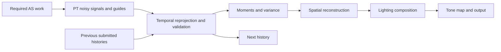

# R6 — Interactive path tracing and temporal reconstruction

Date: 2026-09-29. **Status: active; see the [implementation journal](../../../.spec/journal/2026-09-29-r6-implementation.md) and [spec](../../../.spec/specs/render-r6-interactive-path-tracing.md).**
Baseline inspected: HEAD `dbb84c4461747bfd2a8db0e2c94a2233953c73c5` plus existing uncommitted edits to `ray_tracing_path_tracer.rgen` and `path_tracing_scene_data.h`. Preserve those edits and identify their binary/shader hashes when measuring.
Related work: [R4.7 GPU strategy](R4.7-gpu.md), [R4.7.13 preview/denoise review](../.review/R4.7.13.md), [R5 ownership plan](R5.md).

## Objective and decisions

Produce a general-scene interactive PT mode that remains denoised during camera movement, with the user's additional point and directional lights enabled. Target **60 FPS without frame generation**, with total GPU p95 at most 16.67 ms and separately reported presentation/CPU times on the selected RTX 4070 Laptop GPU fixture. This is a target requiring validation, not a promised speedup.

Start with explicit **1 SPP per frame, native viewport resolution, existing bounce limit**, then reconstruct across frames. Keep progressive raw Beauty as an independent reference mode. Test 2 SPP separately. Any reduced bounce limit or render scale must be a labeled quality preset with independent acceptance, never counted as equivalent-work optimization. Do not silently turn off a light, indirect transport, authored materials, shadows or environment to meet the target.

The user's SRAM mention was an example of a possible optimization, **not a
selected target or implementation requirement**. R6.0 must identify the
dominant current GPU work before choosing changes. Memory techniques below
are conditional examples; light visibility, traversal, reconstruction or other
measured costs may take priority. No SRAM work is required to complete R6.

R5.2/R5.3 runtime/lifetime gates and the R5.4 injected-frame layout issue remain open. R6.0 measurement can proceed independently; history allocation and graph execution changes require those affected correctness contracts to be closed first. This plan does not declare R5 complete.

## What the current code establishes

- `passes/path_tracing_pass.cpp`, `ComputeHistorySignature` hashes camera position and view-projection; `UpdateHistorySignature` sets global sample count to zero when that signature changes. Progressive history is intentionally invalidated on movement.
- `ray_tracing_path_tracer.rgen` blends the same pixel from `history_image` using that global count. There is no reprojection or per-pixel validity/confidence. The primary guide stores normal and radial distance only; this is not view-space Z.
- `tone_map.frag` applies a guide/variance-dependent spatial filter to accumulated HDR. It cannot carry valid information between moving views and has no separate diffuse/specular treatment.
- `DirectLight` loops over all scene lights at each continuation hit. Added lights can add visibility work; measure the actual eligible shadow-ray counts before assigning blame. Existing punctual-primary caching should be preserved and the uncommitted shader change assessed, not accidentally overwritten.
- Settings already separate SPP, bounce count, visibility method and reconstruction. Use that separation; do not restore mutually exclusive diagnostic modes as the control model.

The reported 22 FPS corresponds to roughly 45.45 ms presentation time. Configuration, viewport, residency and pass times are not established for that report, so it is **user-observed evidence, not an accepted GPU baseline**. Historical one-SPP static preview measurements were substantially faster than four-SPP Beauty, but they do not establish motion quality or current multi-light performance.

## Reference study and limits

| Reference | Evidence read | Applicable decision |
| --- | --- | --- |
| [gkNextEngine main README.en.md](https://github.com/gameknife/gkNextEngine/blob/main/README.en.md) | Public design documents practical 1/2-SPP PT and denoising; [module map](https://github.com/gameknife/gkNextEngine/tree/main/src/Modules) documents optional temporal upscalers | Adopt low-SPP reconstruction as a distinct real-time product mode; keep integrations modular. Its published benchmark is different hardware/scenes and cannot predict our FPS. |
| [Pinned Sakura source study](../render_graph/sakura_analysis.md), commit `c0fdb2bb30074058cb98df98b8134559d13d67b0` | Existing source study covers typed graph resources, pass phases and a ray-query sample | Declare reconstruction stages and history imports in the graph. The study does **not** establish a production low-SPP temporal denoiser in Sakura. |
| [NVIDIA NRD master README](https://github.com/NVIDIA-RTX/NRD/blob/master/README.md) | API-neutral low-path-count temporal denoising; normal/roughness/viewZ/motion guides, diffuse/specular signals, RELAX/REBLUR, native integration option | Design guide/signal contracts suitable for temporal reconstruction; evaluate RELAX against a small native baseline before adopting a library. No native Vulkan handles in common Render contracts. |
| [Nsight Graphics guide](https://docs.nvidia.com/nsight-graphics/UserGuide/index.html) and local GPU Trace exports | GPU Trace/Shader Profiler workflow reference; retained trace has aggregate metrics and no populated regime rows | Capture ranges and shader evidence tied to this fixture; aggregate throughput is insufficient attribution. |

Fresh gkNextEngine renderer source and the pinned Sakura sample could not be retrieved through web access (cache misses); direct GitHub API access failed TLS. No fresh source revision was pinned. gk findings above are documentation-level, Sakura findings use the existing pinned study. Before borrowing a concrete implementation, retrieve and pin its actual pass/shader source and record differences in estimator, motion convention and history lifetime. NRD is a design reference, not yet a dependency selection. No source was copied.

## Ownership and graph design

`PathTracingPass` owns the noisy estimator and progressive history. Add a concrete Render-owned `PathTraceReconstructionPass` for temporal history, validation, filtering and its pipelines; keep these states out of `DeferredRenderer`. `RayTracingScene` supplies stable object/material identity and previous submitted transforms. A frame-boundary settings snapshot selects raw/progressive/interactive modes.

Graphics creates resources and translates transitions/dispatches; Render owns logical graph uses and reconstruction policy. Current common recorder lacks a general compute-dispatch entry point. R6.4 must choose the smallest justified common compute contract for this consumer or use fullscreen raster filtering initially; do not assume NRD can be wired directly into existing RT dispatch. Shader processing remains in Asset/Resource.

Each arrow must become a typed graph read/write dependency. Use ping-pong physical resources; never read and write the same history subresource in one pass. Import persistent histories explicitly; use graph transients for intermediate filtering. Capture raw radiance, guide, history validity and final output independently. An interactive reconstruction failure fails the required output path or records an explicit fallback outcome; never publish stale denoised output as a successful frame.

## Ordered implementation slices

### R6.0 — Establish the current bottleneck and replay fixture

1. Create a checked-in replay fixture containing the actual point/directional light descriptors, transforms, intensity, shadow settings and the current camera path. Do not assume the checked-in Sponza level already contains the user's live edits. Preserve the original fixture.
2. Fix native viewport extent and output resolution; initially use the user's current extent, and add 1280×720 as a separately labeled budget comparison. Record actual PT/RT-query mode, SPP, bounce limit, reconstruction, Debug Viewer demands, residency, GPU clocks/power/temperature, driver, validation/layers, commit/diff and shader hashes.
3. Rebuild RelWithDebInfo serially; launch outside the sandbox on Default desktop. Warm until assets/residency and shader compilation settle. Run three matched 120-frame warm-up/300-frame measurement windows for static camera and the deterministic motion path. No builds/tests/profile capture during timing windows.
4. Compare matched controls: current SPP, 1 SPP raw, 1 SPP current spatial preview, and 2 SPP raw; all retain the same lights/bounces/materials. Record renderer/presentation CPU and total GPU plus PT, GBuffer/diagnostic demand, AS, tone map and UI costs. Confirm which optional passes actually execute.
5. Collect **separate** Nsight Graphics GPU Trace and Shader Profiler captures for stable and moving frames. Retain named GPU ranges for PT and every reconstruction stage; split diagnostic primary/continuation/visibility workloads only when needed for attribution. Collect shader live/register state, spills/local-memory traffic, occupancy/warp stalls, texture/L2/DRAM bytes and throughput, traversal activity and barrier/queue gaps where supported. If an unavailable counter prevents attribution, record that limit rather than infer it from utilization.
6. Add diagnostic counters for primary/continuation/visibility rays, eligible lights, path-length histogram and termination reason. Use sampled/reduced instrumentation; remeasure without it because global atomic counters can perturb timings. Compare one/all-light controls as diagnostics only, never final acceptance.

**Current evidence (2026-09-29):** static Sponza baseline and three-window
1-SPP controls are recorded in the [implementation journal](../../../.spec/journal/2026-09-29-r6-implementation.md).
They establish a large PT cost reduction from fewer samples, but do not satisfy
the camera replay or fresh Nsight attribution exit. The retained uniform
one-light diagnostic lowers total GPU time further at the same 1-SPP/8-bounce
settings; its raw image remains visibly noisy.

**Exit:** publish current matched baseline, reproducible replay and a ranked cost table with evidence and confidence. Do not multiply/divide FPS by SPP: primary work, output and other passes do not scale that way. Compute the reconstruction budget from measured PT plus other work; sum per-frame times before percentiles, not independent pass p95 values.

Existing trace `build/NsightGPUTrace/KimPeanutEngine_2026_09_27_21_41_24.ngfx-gputrace` and `BASE/GPUTRACE_FRAME.xls` report about 34.3% RT Core, 24.8% SM, 40.8% L2 and 62.7% DRAM throughput across three frames. `GPUTRACE_REGIMES.xls` contains only its header. This does not prove bandwidth saturation or identify the current added-light workload. A new CLI trace was captured on 2026-09-29 (`build/NsightGPUTrace/KimPeanutEngine_2026_09_29_14_22_32.ngfx-gputrace`), but it is not accepted for R6.0 attribution: Runtime activation stats showed a 1920x1080 viewport and incomplete tracked texture residency instead of the matched 1094x631 fully-resident control, and its exported regime table has no data rows. The five-frame aggregate counters therefore do not rank PT shader costs.

### R6.1 — Independent interactive sampling and progressive mode

Add explicit interactive-temporal reconstruction selection; raw Beauty remains available. Keep 1-SPP estimator and 8-bounce initial cap separately controllable from denoising. Use a monotonic rendered-frame/random sequence index independent of progressive sample count: camera resets must not repeat the same noisy sample every frame. Use decorrelated spatial/temporal sampling with versioned deterministic seeds for replay.

Separate three concepts: progressive accumulated sample count, current frame estimator work, and per-pixel temporal history length. Preserve orthogonal query/pipeline visibility selection. Changing output exposure/tone map must not reset scene-linear reconstruction history; camera cuts, extent/projection discontinuities and estimator changes do. Do not automatically switch modes on every mouse event.

**Exit:** 1-SPP raw works with all lights, moving-camera samples change, settings/capture modes remain truthful, progressive Beauty is unchanged. Tests verify policy and seed/reset semantics.

**Implementation note (2026-09-29):** `PathTracingPass` now advances a separate
random frame index only after successful submitted PT work. Guided preview uses
it; progressive Beauty still seeds from accumulated sample count. Presentation
tone mapping is no longer part of the scene-linear history signature. The
focused tests and Debug Vulkan check pass. The moving-camera replay part remains
unverified.

### R6.2 — Guides and motion contract

Output scene-linear noisy radiance with separately defined diffuse/specular contributions and suitable hit distances for the chosen denoiser. Define whether guides represent geometric or shading normals and document world/view space. Supply primary normal, roughness, albedo/material factors, **view-space Z**, surface/object identity, and current-to-previous motion.

For static geometry/camera movement, reproject current primary world position through the previous submitted view-projection. For object movement, transform the current hit through object-local space and the previous submitted object transform; do not pretend camera-only vectors support animated geometry. Establish pixel/UV units, sign, Vulkan Y orientation, jitter subtraction and background/sky handling in one tested contract. If animated geometry lacks previous deformation, reject its history explicitly until supported.

Remember previous matrices/transforms only after successful submitted frames. Add guide debug views and tests for identity camera, translation, rotation and cut. Validate primary guides against raster diagnostics where surfaces match; raster/RT mismatch at alpha-tested or unsupported materials must be handled explicitly.

**Exit:** camera motion vectors correctly track surfaces, guides are valid at native extent, object motion invalidates or reprojects safely, all buffers have graph coverage and retirement evidence.

### R6.3 — Temporal reprojection and per-pixel history validation

Start with a small native temporal pass to validate the contract before introducing a library. Reproject prior history; reject out-of-bounds samples, invalid previous Z, disocclusions, normal/material/object disagreement, camera cuts and unsupported moving geometry. Compare reprojected expected previous depth against previous guide depth; tune thresholds in world/view units rather than comparing unrelated current/previous distances.

Maintain per-pixel radiance, luminance moments, history length and confidence. Cap interactive history, clamp accepted history against a current neighborhood and shorten specular history when roughness/motion demands it. Cold/disoccluded pixels bootstrap spatial variance; **one sample's zero sample variance is not evidence of zero uncertainty**. Initial history cap and thresholds are tuning inputs, frozen by the quality tests rather than asserted universal constants.

Camera movement alone must not globally discard valid history. Material/light changes initially reset reconstruction globally for correctness; local reactive masks are a later measured refinement. Reset progressive Beauty on movement as before. Failed required frames do not rotate/commit histories or previous-frame transforms.

**Exit:** no stationary-camera history mismatch, translation/rotation reuse valid pixels, disoccluded areas reject old lighting, cuts clear history, rejected frames do not commit. Capture rejection masks and history-length images.

### R6.4 — Spatial filtering and denoiser selection

Move interactive filtering out of tone map. Prototype variance-guided à-trous reconstruction with 3 iterations (steps 1/2/4), independently configurable, guided by depth/normal/roughness/material identity. Filter demodulated diffuse carefully and remodulate once; use a defined treatment for specular rather than blurring total shaded color across albedo edges. Preserve emissive and thin features; guard zero material factors and nonfinite radiance.

In parallel **as a later experiment, not concurrent build jobs**, evaluate pinned NRD RELAX diffuse/specular integration using the same guides and replay. Follow NRD's exact signal packing, hit-distance and material-factor conventions; no assumption that a Beauty RGB image plus normals is sufficient. Implement its dispatch/resource needs through common engine capabilities, not raw backend access from Render. Compare native reconstruction versus NRD GPU cost, memory, motion stability and integration scope. Select one backend from measured evidence; retain a documented no-adoption decision if NRD is too costly or blocked.

Start fullscreen fragment passes if that closes the guide/history baseline with existing contracts. Introduce bounded compute dispatch/storage binding only if the selected denoiser requires it or measured local filtering warrants it. Texture histories remain Render-policy-owned/Graphics-allocated, with graph barriers and safe cleanup.

**Exit:** separate temporal/filter/composition timings; acceptable multi-light moving-camera image; no denoiser hidden inside tone-map timing. Resource resize/reload/disable and injected-failure cleanup pass Debug Vulkan validation.

### R6.5 — Reduce light/visibility work if R6.0 confirms it matters

Preserve cheap exact evaluation for a small light set when it wins. First remove provably ineligible lights before launching visibility rays (disabled, out of range, back-facing contribution); preserve existing primary punctual caching. Compare query versus RT-pipeline visibility with matched estimator/settings.

If per-bounce all-light visibility dominates, prototype one importance-sampled eligible light per hit with explicit probability `p(light)` and contribution divided by that probability. Give every contributing light nonzero probability, including directional and area lights; normalize selection and combine area/BSDF strategies with appropriate MIS where applicable. Keep exact all-light mode as a quality oracle. Measure extra variance at equal wall time, not only shadow-ray reduction. Do not add ReSTIR DI until this simpler sampling choice fails the many-light quality/cost test.

**Exit:** reduced eligible-ray counts and GPU time in three repeated matched windows, no systematic energy/color bias against all-light reference, and temporal noise/ghosting acceptance. A three-light scene alone does not justify reservoirs.

### R6.6 — Select remaining GPU changes from measured evidence

| Observed result | Next bounded experiment | Reject/retain rule |
| --- | --- | --- |
| Hit shading/material fetch dominates with high relevant bytes/stalls | Audit redundant texture reads, layout/packing and measured explicit LOD; hold BSDF/path survival fixed in diagnostics | Reject material/LOD simplification that changes wall colors or regresses equal-time quality. Prior ray-cone LOD regression remains evidence. |
| Register/live-state/spill stalls dominate identified PT shaders | Shorten live scopes/payload and remove duplicate retained values one change at a time | Prior compact-payload trial did not win; do not repeat without a new identified cause. |
| Traversal dominates the identified geometry | Audit BLAS flags/build quality and opaque eligibility, ray masks/distances and AS memory | Preserve alpha/material correctness and static AS reuse; no per-frame rebuilding as a performance fix. |
| Divergent hit shading remains dominant after above | Capability-gated SER experiment; wavefront queues only with a measured crossover case | No shader reordering/wavefront rewrite from utilization percentages alone. |
| Trace cost still exceeds native target with accepted reconstruction | Explicit 0.75 linear resolution preset plus reconstruction/upscale, then 0.5 only if necessary | Record both input/output resolution; squared pixel reduction is theoretical, not a measured speedup. |

Keep the initial bounce cap for equivalent-estimator comparisons. A later 2/4-bounce interactive preset is allowed only with visible indirect-light loss documented. SHARC/radiance cache, ReSTIR GI and DLSS RR are future follow-ups, not prerequisites for this first motion-denoising stage.

**Exit:** each retained optimization has measured attribution, repeated total-frame improvement above run-to-run noise and a quality result. An experiment that fails is recorded and reverted individually.

**Diagnostic result (2026-09-29):** uniform one-light sampling is opt-in through
`single_light_preview`. Three matched static RelWithDebInfo windows retain all
three light records and eight bounces. Median total GPU p50/p95 is 13.76/15.25
ms, versus 16.53/18.36 ms for three serial all-light 1-SPP guided-preview
windows using the same 120-frame warm-up and 300-frame sample window. The paired
420-frame capture is visibly noisier than all-light sampling. Keep the control
opt-in for reconstruction experiments; it does not pass the R6.5 quality exit
and is not evidence of final R6 performance acceptance.

### R6.7 — Acceptance and release gate

Run Cornell (area-light penumbra and color bleeding), multi-light Sponza and a smaller textured/glossy fixture. Use a deterministic replay with static hold, strafe past a column, camera pan, fast turn, stop, camera cut, light toggle/move, object move, resize/reload and mode toggle. Cover query/pipeline visibility where supported; RT-off raster/OpenGL behavior remains compatible.

Produce converged reference images for **each selected camera pose**, rather than treating a previous pose as ground truth. Compare linear HDR and fixed-exposure display output separately. Before implementation acceptance, freeze numeric error/temporal-flicker tolerances from the reference set; provisional minimum gate is at least 30% lower motion-sequence image error than 1-SPP raw at the same input resolution, no systematic wall-color/energy drift, and no persistent wrong-surface history after a cut or disocclusion. Noise-normalized temporal residuals must compensate motion, not confuse parallax with flicker. Supply a replay video and masks for trails, light lag, thin-feature loss and glossy highlights. Numeric thresholds alone do not pass visibly wrong lighting.

Performance acceptance uses three matched RelWithDebInfo windows on the full-light motion fixture, actual SPP and resolution exposed in Runtime, total GPU p95 ≤16.67 ms and sustained presentation at least 60 FPS under fixed conditions. Record CPU wait versus active CPU cost. If native resolution misses the budget but an explicit scaled preset passes, accept that preset separately and leave native-60 acceptance open. No frame-generation FPS claims.

Correctness uses rebuilt Debug with Vulkan validation and the affected render/graphics contract suite, real Runtime captures under `save/screenshots/validation/`, safe close and zero leaked histories/bindings. Builds run serially using `tools/kp.ps1`; shared Graphics contract changes require the validation matrix's broader checks. No runtime/visual acceptance from compilation alone.

## Acceptance ledger

- [ ] R6.0: current multi-light motion baseline, replay and Nsight attribution.
- [ ] R6.1: independent 1-SPP interactive sampling and progressive reference.
- [ ] R6.2: validated guides, camera/object motion contract and graph coverage.
- [ ] R6.3: per-pixel temporal history with disocclusion/failure correctness.
- [ ] R6.4: measured spatial reconstruction and native/NRD selection.
- [ ] R6.5: evidence-gated light/visibility optimization or documented no-change.
- [ ] R6.6: evidence-selected remaining GPU changes and truthful presets.
- [ ] R6.7: moving-camera quality, performance and lifecycle acceptance.

All items remain open. The first action is R6.0, followed by guide/history correctness; no speculative large GPU architecture rewrite is required to begin.

## Deeper Nsight reading: what costs GPU time, and whether SRAM helps

The following values were recomputed on 2026-09-29 as arithmetic means of
the three columns in the retained `BASE/GPUTRACE_FRAME.xls`. They are **old
whole-frame evidence**, not a fresh multi-light/motion capture. Names below
preserve enough of the exported metric to distinguish normalization.

| Counter | Mean | Interpretation and confidence |
| --- | ---: | --- |
| DRAM total/read/write throughput, percent of peak sustained elapsed | 62.689 / 61.317 / 1.372% | Read traffic dominates external-memory traffic. Strong observation; not proof of saturated bandwidth or which pass generated it. |
| L2 throughput / TEX-source sector throughput, percent of peak | 40.787 / 39.968% | The TEX source is prominent in L2 traffic. Does not identify individual material texture samples; texture/load pipeline traffic and source attribution are not per-resource attribution. |
| L2 average sector hit rate | 81.222% | Much traffic already hits cache; the remaining misses/latency can still matter. No evidence that copying the scene into shared memory would solve this. |
| Compute-category active warps, percent of peak | 24.076% | Low aggregate occupancy/active-warp level; cannot distinguish register limits, traversal waits or inactive categories without shader/range attribution. |
| Compute-category warp-launch register-allocation stalls, percent of peak elapsed | 17.615% | Register allocation is a meaningful candidate limiter. This is not registers/thread, spill bytes, or 17.6% of PT runtime. |
| Sampled long-scoreboard RT Core / L1TEX stalls, percent of peak elapsed | 6.207 / 5.044% | Traversal-result and texture/load-result waits both appear; RT wait exceeds L1TEX wait in these counters. This is not a direct timing split. |
| Sampled math-pipe throttle / texture-pipe throttle | 0.127 / 0.005% | These counters do not suggest arithmetic or texture issue-rate saturation as the obvious first target. Missing per-shader data prevents a definitive exclusion. |
| Front-end synchronous wait-for-idle stalls | 1.374% | Smaller than the above pressures in this capture; not a basis for prioritizing a submission rewrite. |

**Cost ranking:** historical matched engine timings identify PT as the largest
pass (roughly 28 ms of a roughly 33 ms diagnostic-active frame in the R4.7.8
investigation). Inside PT, the trace supports a combination of read traffic,
traversal/load latency and insufficient latency hiding/register pressure.
It does not yield an exclusive bandwidth-versus-traversal root cause. The
largest throughput percentage and the largest sampled-stall percentage have
different denominators and must not be added or converted into milliseconds.
Today's 22-FPS light setup is still unmeasured.

There is stronger experimental evidence for useful directions in
[R4.7.8](../.review/R4.7.8.md): a fixed-transport fetch/no-fetch diagnostic
changed PT p50 from 16.021 to 13.307 ms, establishing material-fetch/UV cost in
that simplified workload; inline query visibility changed the repeated
Scene Color-only total p50 from 28.204 to 26.250 ms. Neither number predicts
the new fixture. Compact payload, Beauty specialization and primary retracing
did not produce an accepted win. Those failures constrain the next experiments.

### Conditional memory examples; no SRAM optimization selected

GPU registers and caches use on-chip storage; workgroup shared memory is
explicitly programmable for appropriate compute workloads. They cannot be
treated as one pool that Render can allocate for arbitrary PT scene data.
Do not transfer CUDA shared-memory-spilling switches into this Vulkan GLSL
pipeline: they are a different compiler/execution contract.

1. **Registers and ray-tracing live state — only if attribution warrants it.**
   Use Nsight Shader Profiler's RT Live State view to identify the exact
   `TracePrimary`, continuation trace and visibility callsites with large
   preserved values. Inspect registers and spill/local-memory bytes for the
   relevant shader, then shorten the identified values' lifetimes or recompute
   cheap values after the trace. Benchmark one change at a time. Smaller source
   structs alone are insufficient; previous payload compaction already failed
   acceptance. Reduce actual register/live-state traffic without adding more
   expensive retracing or increasing occupancy-related spills.
2. **L1/L2 coherence — useful only for identified reads.** Check hit-shader
   material/vertex/index access, table stride, redundant fetches and lane
   coherence. Pack only fields consumed together and validate alignment/ABI;
   compare fetched bytes and cache misses along with shader time. Keep authored
   textures/BSDF and traversal distributions fixed in diagnostic controls.
   Cache hit rate is not an acceptance metric by itself: total GPU time and
   quality decide. AS working sets and random secondary hits do not generally
   fit in a small per-workgroup tile.
3. **Compute shared-memory tiles — optional if spatial-filter cost warrants
   an experiment, not a required implementation.** Compare a
   texture-cache-only fullscreen/compute filter against a compute implementation
   cooperatively loading radiance/guide tiles. First test 8×8 output workgroups
   and the 5×5 filter: step 1 needs a 12×12 input tile; step 4 needs 24×24.
   With an illustrative 32 bytes per loaded signal/guide record, the latter
   is 18,432 bytes before padding/additional signals. Query device limits and
   inspect residency/occupancy; do not assume that footprint is automatically
   fast or sufficient for diffuse/specular data. All threads participate in
   loads/barriers, including image-edge lanes; avoid bank conflicts and
   excessive per-thread registers. Capture read bytes, barrier stalls,
   occupancy and per-iteration time. Retain tiling only if the **whole
   reconstruction chain** wins at unchanged image output.

Dedicated raygen/closest-hit shaders do not provide the same conventional
cooperative workgroup/shared-memory model as compute filtering. Moving PT to
compute ray queries merely to obtain shared memory requires new scheduling,
register and divergence evidence; it is not a simple SRAM switch. Most bounce
hits do not share predictable screen-space neighborhoods, unlike denoiser taps.

**Concrete next profiling session:** capture current full-light native 1-SPP
and current-Spp frames with named ranges; select PT in Shader Profiler; retain
callsite live-state/register/spill data and the hit-shader texture instruction
hotspots. Compare the all-light diagnostic ray counts to the visibility ranges,
then choose light sampling versus identified live-state/material work. After
R6.4 exists, benchmark tiled filtering separately. Keep timing windows outside
profiler capture. If Nsight cannot expose the required fields, retain the
missing-field report and use controlled paired diagnostics; do not replace
measurement with an occupancy guess.

References for this decision: [NVIDIA Shader Profiler](https://docs.nvidia.com/nsight-graphics/UserGuide/shader-profiler.html),
[RTX best practices](https://developer.nvidia.com/blog/best-practices-for-using-nvidia-rtx-ray-tracing-updated/),
and [measured live-state reduction case study](https://developer.nvidia.com/blog/path-tracing-optimization-in-indiana-jones-shader-execution-reordering-and-live-state-reductions/).
These support the method, not a promised speedup for KimPeanutEngine.
